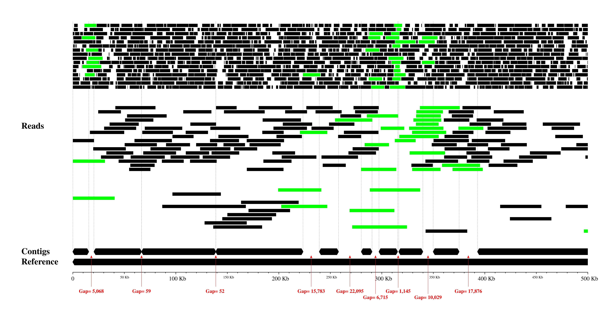
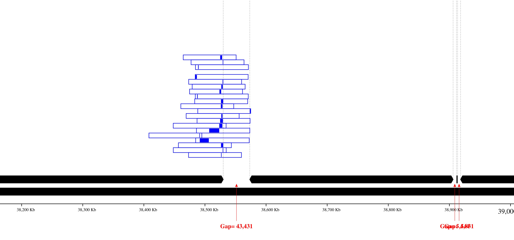
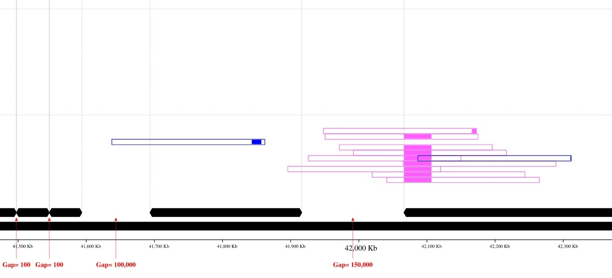
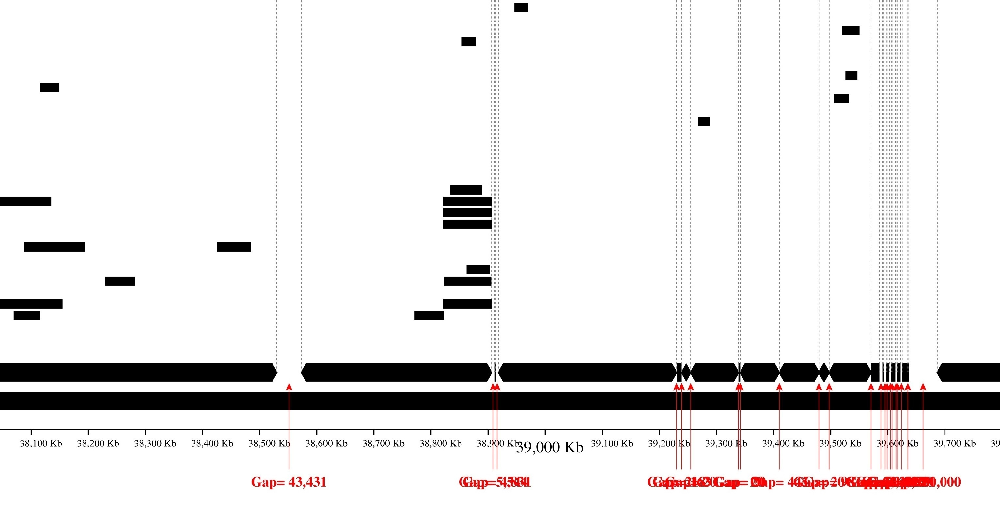
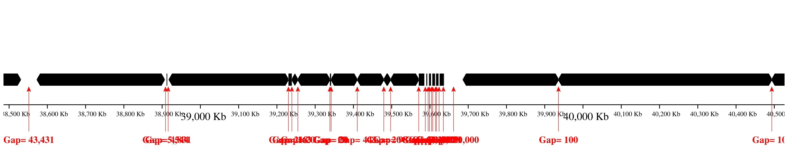

# ra-visualizer
Genome read alignments visualizer

**ra-visualizer** is a Python script for visualizing genome reads and/or contigs alignments to reference.

It can generate the following pictures (in .svg format), with arbitrary zoom and offset, relative to the start 
of the reference: 
Image with reads coloring: 
  
 
 
 
Only contig mapping output: 
 

## Dependencies
* TeX Live  
  (`sudo apt install texlive`)
* bwa

Python packages:
* pyx
* pysam

**NB.** Python package `pysam` is working only for Linux OS, but for Windows users there are several ways
how to make everything work.  One of them is described in the next section.

## For Windows
Install Linux (for example, Ubuntu 22.04.2 LTS) with WSL for Windows (you can use any instruction on Web 
how to do this, for example, see first steps in [this article](https://ruslanmv.com/blog/Python3-in-Windows-with-Ubuntu)). 
After that you can install `python3` and all dependencies for it (don't forget to install texlive). 
After all, you can run `python3 src/visualize.py` in folder `/mnt/<PATH_TO_PROJECT_DIR>`.

## Run steps
Suppose you have:
1. Reference in `.fasta` format
2. Some assembly (contigs) in `.fasta` format
3. And long reads in `.fastq` format...  

What you should do to visualize it all together? ☺

Run these steps:
1. `bwa index reference.fasta`
2. `bwa mem reference.fasta contigs.fasta > contigs.sam`
3. `bwa mem -x ont2d -A1 -B2 -O2 -E1 -t <number_of_CPUs_to_use> reference.fasta reads.fastq > reads.sam`  
  **NB.** This command is used for Oxford Nanopore long reads.  For other sequencing technologies you should use
    different command to align reads to reference.
4. (temporary) Generate `.stats` file from `contigs.sam` file via command:  
  `python3 src/gen_stats_table.py -i contigs.sam -o contigs.stats`
5. (temporary) Generate `.stats` file from `reads.sam` file via command:  
  `python3 src/gen_stats_table.py -i reads.sam -o reads.stats`
6. Run Visualizer:  
  `python3 src/visualize.py --ref-size <reference_size> -c contigs.stats -r reads.stats`
7. See the resulting `output.svg` image and/or change the output options in the previous step

**NB.** If you don't have assembly or reads, you can run Visualizer without it. Just skip the commands 2,4 or 3,5
(depending on what data is missing), and don't pass the corresponding parameter to Visualizer.

## Example 1
Let's assume you have:
1. Reference of E.coli bacterium in file `ecoli.fasta`
2. Some assembly (contigs) in file `contigs.fasta`
3. A long nanopore reads in file `nanopore-reads.fastq`

All files are placed in [example1](/example1) folder.

So, to view it all together, run steps from '[Run steps](https://github.com/svkazakov/ra-visualizer#run-steps)' section. Or you can use ready-made files
`contigs.stats` and `nanopore-reads.stats` in the example folder to view the resulting image. For that, run the command from the project folder:  
`python3 src/visualize.py --ref-size 4641652 -c example1/contigs.stats -r example1/nanopore-reads.stats`  
After that you can view the resulting image `output.svg` in the project folder.  
You can also change the output options (you can see all available options by running `python3 src/visualize.py -h`).

## Example 2
Let's assume you:
1. Don't have any references... 
2. But you have assembly in file `contigs.fasta`
3. And long reads in file `nanopore-reads.fastq`

What you should do to visualize it?

... TBA

## Future improvements

* Add support for working directly with .sam files.

If you have any ideas how to improve this project, you can write me directly to svkazakov.me at gmail.com. 

## Questions, feedback
Please report any problem through the GitHub [issue tracker](https://github.com/svkazakov/ra-visualizer/issues).  
For other questions write me directly to svkazakov.me at gmail.com.

## License
The MIT License (MIT)
